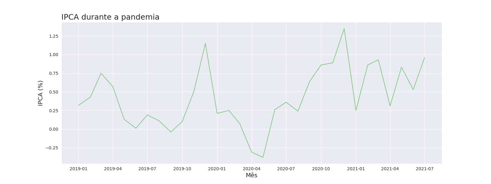
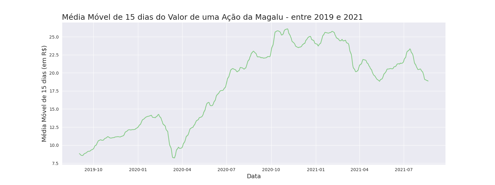
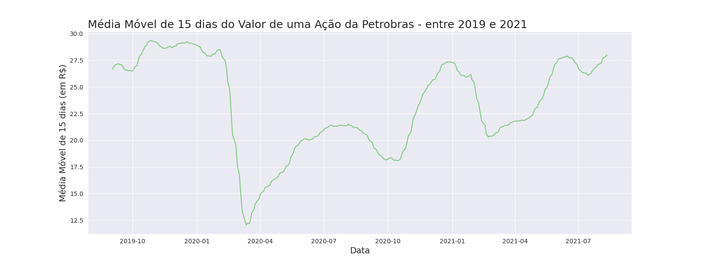
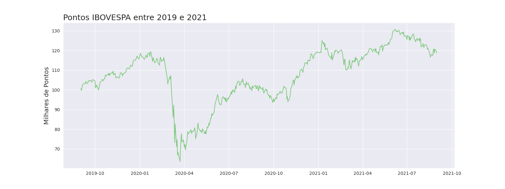
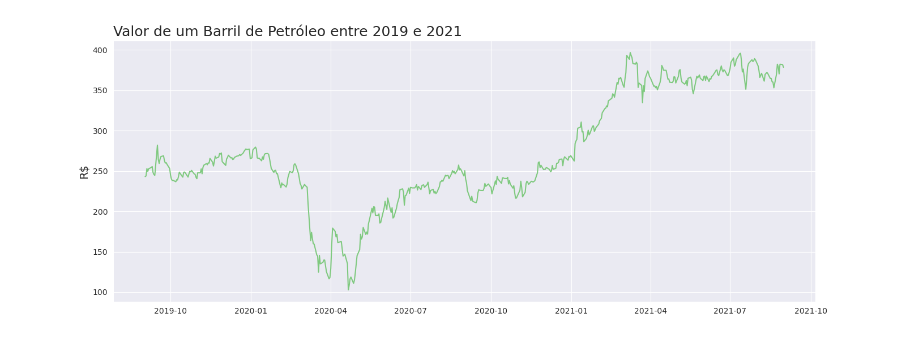
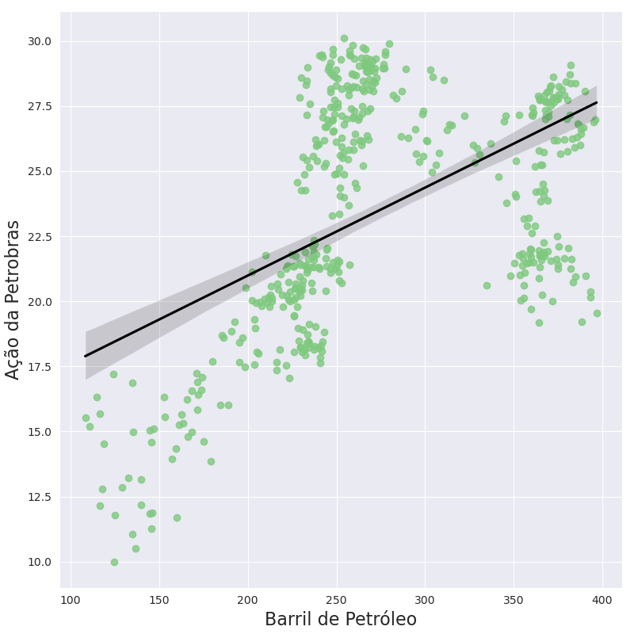

# Explorando o mercado financeiro brasileiro durante a pandemia

Este projeto, desenvolvido inteiramente em Python, tem como objetivo analisar os impactos da pandemia no mercado financeiro brasileiro, investigando as causas por trás das oscilações nas métricas avaliadas. Os dados utilizados abrangem o período de 2019 a 2021.

| :label: Tecnologias   | Python, Jupyter Notebook, Power BI  |

## Principais análises realizadas

O projeto começa avaliando a inflação (IPCA) durante o período pandêmico. Em seguida, analisa o desempenho das ações de empresas como Magalu e Petrobras, culminando na construção de um modelo de regressão para entender os comportamentos dessas ações. Para isso, utilizou dados relacionados ao preço do barril de petróleo, taxa do dólar e a pontuação do Ibovespa.

### [Fonte dos dados](http://www.infomoney.com.br)

## Gráficos e Análises

### Inflação (IPCA)

A inflação apresentou queda no início da pandemia devido à redução do consumo e à incerteza econômica. No entanto, antes dessa queda, houve um pico devido à corrida por produtos essenciais. Mais tarde, o auxílio emergencial e a flexibilização das restrições impulsionaram o consumo, resultando em um aumento na inflação.

### Magalu

As ações da Magalu cresceram significativamente após uma queda inicial. Essa recuperação foi impulsionada pela rápida adaptação ao e-commerce e pela redução da concorrência durante o período. No entanto, a partir de 2022, fatores como a alta da taxa de juros (Selic) e a concorrência de grandes players internacionais prejudicaram a empresa.

### Petrobras

A Petrobras enfrentou uma desvalorização de mais de 50% no início da pandemia. Apesar de algumas instabilidades políticas e mudanças administrativas em 2020 e 2021, a empresa conseguiu manter resultados consistentes no mercado.

### Ibovespa

A bolsa brasileira seguiu um padrão de queda acentuada no início da pandemia, seguida por uma recuperação gradual. Em 2021, conseguiu superar a pontuação registrada antes da pandemia.

### Barril de Petróleo

O preço do petróleo caiu drasticamente em março de 2020 devido à redução na demanda. A partir de 2021, a combinação de estabilização na demanda e desvalorização do Real frente ao dólar levou a um aumento nos preços.

### Correlação entre Petróleo e Petrobras

A análise revela que a relação entre o preço do petróleo e as ações da Petrobras não apresenta uma correlação significativa ou um padrão linear claro. Esse resultado era esperado, considerando a limitação do conjunto de dados e a complexidade inerente ao mercado financeiro. Mesmo com um volume maior de dados e variáveis adicionais, prever com exatidão os movimentos do mercado é uma tarefa desafiadora, dado que ele é influenciado por fatores externos e comportamentos humanos, frequentemente imprevisíveis e não lineares
---
